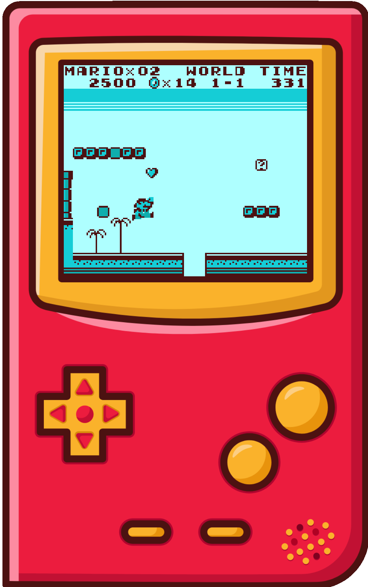
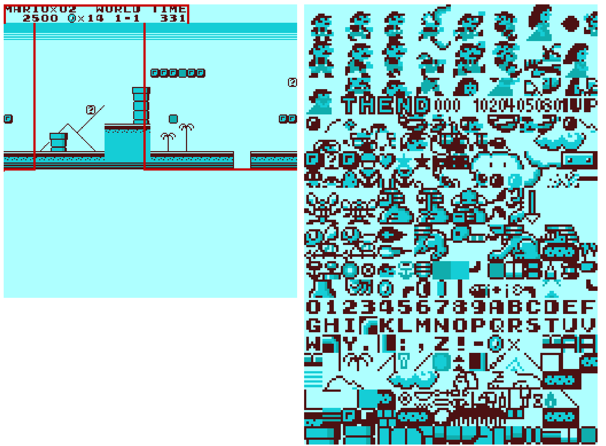
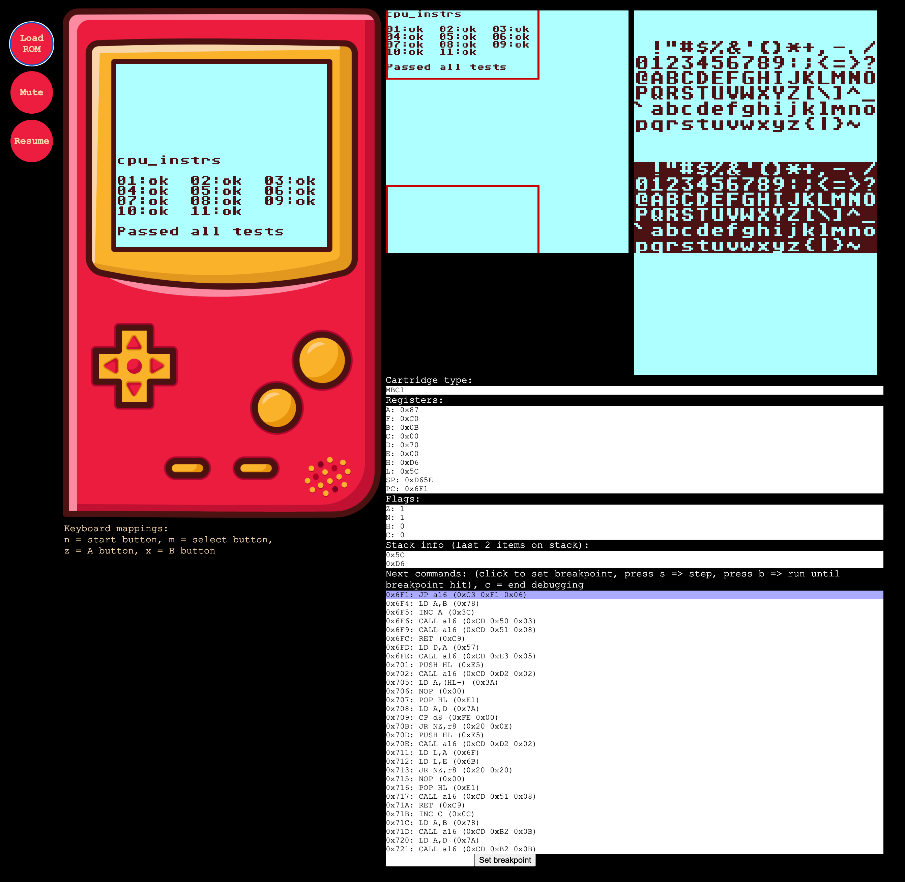

## About

After talking to a friend and colleague of mine about the Game Boy and emulators in general, I got very nostalgic and had the sudden urge to write a simple Game Boy emulator myself. I pretty much just wanted to find out how to do it. And since I hadn't touched TypeScript in forever and needed to up-skill a bit, I thought I'd just give it a try in TypeScript and see how it goes. (I actually didn't end up using most of TypeScript's language features but it was fun anyway)

So here it is, a very basic TypeScript-based Game Boy emulator. It's mostly a learning project and not feature complete, so don't use it if you're serious about playing games. However, feel free to use it as a reference or to just explore games and do some debugging.

Speaking about debugging, I was mainly interested in how the Game Boy does things under the hood so I added some CPU and PPU debugging capabilities. You can pause a game at any time and step through the code. In addition, you can see how the full background buffer looks like, including a visualization of the visible area while playing a game.

## Try it

Just head to https://svenschindler.github.io/gameboy-emulator/ to give it a try.

To run the emulator with webgl rendering enabled, go to https://svenschindler.github.io/gameboy-emulator/index.html?enableWebGl=true

## How to build and run

To build:

`yarn build`

To run:

`yarn start`

## Debug

To debug a game just load the rom of your choice and press `d` whenever you want to start the debugger. This will open the PPU and CPU debugging screens.

## Feature support

The following core features have been implemented and have been running pretty stable in my tests:

- CPU
- PPU
- DMA
- Timer
- Bus
- APU

You'll find 2 APUs in the code base. A more complex one and a simple and hacky one. The simple one is pretty fast but not very accurate and without pcm and stereo support. The complex one supports pcm and stereo but requires a fast machine to run since timing is pivotal for this engine.

The emulator supports the following cartridge types:

- ROM only
- MBC 1
- MBC 2
- MBC 3
- MBC 5

I added support for the most common cartridge types. However, if you're missing one, adding a new type shouldn't be this hard and can just be added to `src/cart.ts`.

## Main references

- https://gbdev.io/pandocs/ (probably the best doc out there)
- https://meganesulli.com/blog/game-boy-opcodes/ (Game Boy CPU instruction set, couldn't have done this project without it)
- https://www.youtube.com/@lowleveldevel1712 (amazing youtube channel about low level programming in general, includes an amazing Game Boy series and is great to get started)

I also linked a few more references in the code.
